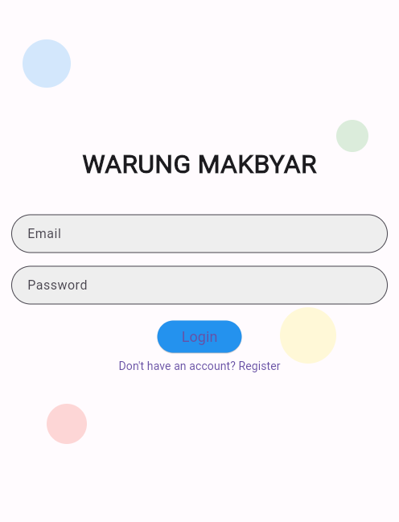
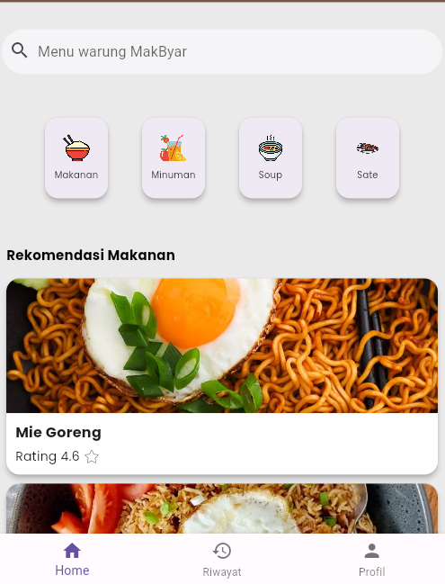
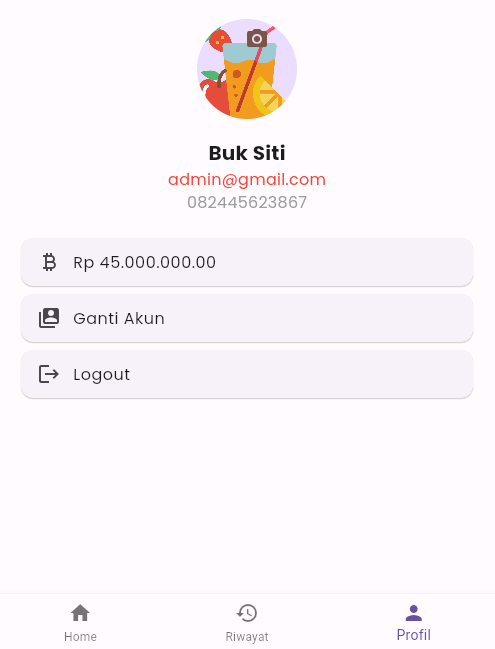

# Aplikasi Pemesanan makanan MAKBYAR

Aplikasi ini adalah aplikasi MAKBYAR yang memungkinkan pengguna untuk menjelajahi menu makanan, melihat rekomendasi makanan, dan mengakses profil pengguna. Berikut adalah fitur-fitur utama yang ditawarkan oleh aplikasi ini:

# Nama Kelompok
- 1.I Putu Agus Adi Saputra (2101020070)
- 2.Ngakan Putu Herry Suputra (2101020062)
- 3.Angga Karma Nugraha (2101020039)

## Fitur Utama

### Halaman Utama (HomePage)
- Menampilkan ucapan selamat datang kepada pengguna.
- Menyediakan kotak pencarian untuk mencari menu makanan.
- Menampilkan kategori makanan dengan ikon yang menarik.
- Menampilkan rekomendasi makanan berdasarkan data yang diambil dari Firestore.

### Navigasi Antar Halaman
- Menggunakan `BottomNavigationBar` untuk berpindah antara halaman utama, halaman riwayat, dan halaman profil.
- Pengguna dapat mengklik rekomendasi makanan untuk melihat detail lebih lanjut tentang makanan tersebut di halaman `DetailPage`.

### Halaman Rekomendasi Makanan
- Mengambil data rekomendasi makanan dari Firestore dan menampilkannya dalam bentuk kartu yang menarik.
- Setiap kartu rekomendasi makanan menampilkan gambar, nama makanan, dan rating.
- Pengguna dapat mengklik kartu makanan untuk melihat detail makanan tersebut.

### Halaman Profil
- Menyediakan informasi profil pengguna.

### Halaman Detail Makanan (DetailPage)
- Menampilkan gambar makanan, nama makanan, harga, rating, dan deskripsi singkat tentang makanan tersebut.
- Menyediakan tombol "Beli Sekarang" untuk memudahkan pengguna dalam memesan makanan.


# Fitur 

1. **Form Login dan Registrasi**
   - Menggunakan `TextFormField` untuk input email dan password.
   - Menggunakan `ElevatedButton` untuk tombol login atau registrasi.
   - Menggunakan `TextButton` untuk beralih antara mode login dan registrasi.

2. **Firebase Authentication**
   - Menggunakan `FirebaseAuth` untuk menangani autentikasi pengguna.

#### Source Code

 **TextFormField untuk Email**
   ```dart
   TextFormField(
     controller: _emailController,
     decoration: InputDecoration(
       labelText: 'Email',
       border: OutlineInputBorder(
         borderRadius: BorderRadius.circular(30.0),
       ),
       filled: true,
       fillColor: Colors.grey[200],
       contentPadding: EdgeInsets.symmetric(
           vertical: 10.0, horizontal: 20.0),
     ),
     validator: (value) {
       if (value == null || value.isEmpty) {
         return 'Please enter your email';
       }
       return null;
     },
   ),
```
# FoodRecommendationCard

`FoodRecommendationCard` adalah sebuah widget dalam aplikasi restoran berbasis Flutter yang digunakan untuk menampilkan rekomendasi makanan. Widget ini menampilkan gambar makanan, nama makanan, dan rating makanan.

## Fitur Utama

- Menampilkan gambar makanan.
- Menampilkan nama makanan.
- Menampilkan rating makanan.
- Mengambil data dari API untuk rekomendasi makanan.

## Komponen Utama


1. **Gambar Makanan**
   - Menampilkan gambar makanan menggunakan `Image.network`.

2. **Nama Makanan**
   - Menampilkan nama makanan dengan gaya teks yang menarik menggunakan `GoogleFonts.poppins`.

3. **Rating Makanan**
   - Menampilkan rating makanan dengan menggunakan simbol bintang.

## Source Code

Berikut adalah potongan kode untuk `FoodRecommendationCard`:

```dart
import 'package:flutter/material.dart';
import 'package:google_fonts/google_fonts.dart';

class FoodRecommendationCard extends StatelessWidget {
  final String imagePath;
  final String foodName;
  final String rating;

  FoodRecommendationCard({
    required this.imagePath,
    required this.foodName,
    required this.rating,
  });

  @override
  Widget build(BuildContext context) {
    return Card(
      elevation: 5, // Tambahkan elevasi untuk efek bayangan
      clipBehavior: Clip.antiAliasWithSaveLayer,
      shape: RoundedRectangleBorder(
        borderRadius: BorderRadius.circular(15), // Tambahkan border radius
      ),
      margin: EdgeInsets.symmetric(horizontal: 10, vertical: 5), // Tambahkan margin antar kartu
      child: Column(
        children: [
          SizedBox(
            width: double.infinity,
            height: 150,
            child: Image.network(imagePath, fit: BoxFit.cover), // Ganti Image.asset ke Image.network untuk gambar dari URL
          ),
          Container(
            width: double.infinity,
            color: Colors.white, // Tambahkan warna background putih
            padding: EdgeInsets.all(10), // Tambahkan padding
            child: Column(
              crossAxisAlignment: CrossAxisAlignment.start, // Supaya teks dimulai dari kiri
              children: [
                Text(
                  foodName,
                  style: GoogleFonts.poppins(
                    fontSize: 16, // Sedikit perbesar ukuran font
                    fontWeight: FontWeight.bold,
                  ),
                ),
                SizedBox(height: 5), // Tambahkan jarak antara foodName dan rating
                Text(
                  "Rating $rating ⭐",
                  style: GoogleFonts.poppins(fontSize: 14),
                ),
              ],
            ),
          ),
        ],
      ),
    );
  }
}
```

# ProfilePage

`ProfilePage` adalah sebuah halaman dalam aplikasi restoran berbasis Flutter yang menampilkan informasi profil pengguna, memungkinkan pengguna untuk mengambil gambar profil menggunakan kamera, dan menyediakan opsi untuk logout.

## Fitur Utama

1. **Menampilkan Informasi Profil Pengguna**
   - Menampilkan gambar profil.
   - Menampilkan nama pengguna.
   - Menampilkan email pengguna.
   - Menampilkan nomor telepon pengguna.



2. **Mengambil Gambar Profil**
   - Menggunakan kamera untuk mengambil gambar profil.

3. **Logout**
   - Mengizinkan pengguna untuk logout dari aplikasi.

## Komponen Utama

### 1. **Menampilkan Informasi Profil Pengguna**

Menampilkan informasi profil pengguna seperti gambar profil, nama pengguna, email, dan nomor telepon.

#### Source Code:
```dart
Center(
  child: CircleAvatar(
    radius: 50,
    backgroundImage: _image != null
        ? NetworkImage(_image!.path)
        : AssetImage('drink.png') as ImageProvider, // Replace with your default profile picture path
  ),
),
SizedBox(height: 20),
Center(
  child: Column(
    children: [
      Text(
        'Buk Siti',
        style: GoogleFonts.poppins(fontSize: 20, fontWeight: FontWeight.bold),
      ),
      Text(
        user != null ? user!.email! : 'user@example.com',
        style: GoogleFonts.poppins(fontSize: 16, color: Colors.red),
      ),
      Text(
        '082445623867',
        style: GoogleFonts.poppins(fontSize: 16, color: Colors.grey),
      ),
    ],
  ),
),
```
# Petunjuk Instalasi

### Prasyarat

Sebelum memulai instalasi, pastikan Anda telah menginstal prasyarat berikut:

1. [Flutter](https://flutter.dev/docs/get-started/install)
2. [Dart](https://dart.dev/get-dart)
3. [Git](https://git-scm.com/book/en/v2/Getting-Started-Installing-Git)

### Langkah Instalasi


1. **Clone Repository**

   Clone repositori ini ke komputer Anda menggunakan perintah berikut:

   ```bash
   git clone https://github.com/username/repository.git

- dan jangan lupa membuat akun di firebase
